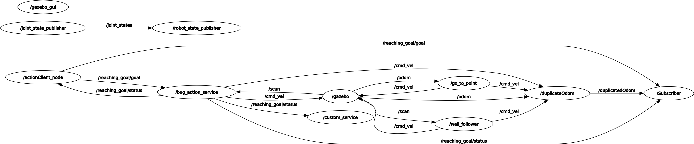

# Python Robotics Simulator Assignment

HADJ SAID Baba S5413915

## Assignment

In this assignment, a ROS package was developed to control a robot's movement and gather information about its position and speed. The package includes the following features:

- An action client node that allows the user to set a target (x,y) position for the robot or cancel the current goal.
- A publisher node that publishes the robot's current position and velocity as a custom message  using the /odom topic.
- A service node that prints the number of goals reached and canceled by the robot. 
- A subscriber node that listens to the robot's position and velocity and prints the distance of the robot from the target and the robot's average speed. This node also uses a parameter to set the frequency at which it publishes the information.
- A launch file to start the simulation and set the frequency for the subscriber node.<br/>


This package demonstrates the use of ROS actionlib, subscribers, publishers, and services to control and gather information about a robot's movement.
The following graph demonstrate the connection between nodes:


## Pseudocode

The content of the code is described by the following pseudocode:
- actionClient_node:(this the answer to first part of question 1 )
```console
    initialize node
    create action client
    initialize goal

    while true:
        prompt user for input
        if input is "cancel"
            cancel goal
        else if input is "exit"
            break loop
        else
            parse input for x and y coordinates
            set goal coordinates to x and y
            send goal to action
```
- duplicateOdom: (this the answer to second part of question 1 )
```console
    Initialize ROS node

    Create subscribers for "/odom" and "/cmd_vel" topics, with callbacks "OdomCallback" and "CmdvelCallback" respectively

    Create publisher for "duplicatedOdom" topic

    Print message to indicate the starting of the loop

    Retrieve the value of parameter "/PublishFreq" and store it in variable "Pub_Freq"

    Create a rate object with the value of "Pub_Freq"

    While True:
        Populate custom message "my_msg" with the values of "pose", "angular_vel", and "linear_vel"
        Publish "my_msg" on the "duplicatedOdom" topic
        Sleep for the duration of 1/Pub_Freq
        Spin once for callbacks
```
- custom_service: (this the answer to the question 2 )
```console
    initialize variables: status, tmp, num_reached_goal, num_canceled
    create publisher: "custom_service_topic"

    define callback function MyCallBack:
    if message status list is not empty
        set status to the first status in the list
    if status is 3 (goal reached)
        if status is not equal to tmp
        increment num_reached_goal
        create message with the current value of num_reached_goal
        publish message on "custom_service_topic"
    else if status is 2 (goal canceled)
        if status is not equal to tmp
        increment num_canceled
        create message with the current value of num_canceled
        publish message on "custom_service_topic"
    set tmp to status

    define callback function callback:
    print the number of goal reached and the number of goal canceled
    set success to true in response
    return true

    in main function:
    initialize ros node "custom_service"
    create a subscriber to listen to the status on topic "/reaching_goal/status"
    create a service "my_custom_server_topic"
    ros spin to execute callback
    return 0
```

- Subscriber: (this the answer to the question 3 )
``` console
    Initialize variables: my_msg, goal, start, end, status, tmp, startingpose

    Define callback function MyCallBack(status_msg)
        If status_msg is not empty
            status = status_msg[0].status
        If status is 3 (goal completed)
            If status is not equal to tmp
                end = current time
                duration = end - start
                distanceTraveled = calculate distance between startingpose and my_msg.pose
                avgspeed = distanceTraveled / (duration in seconds)
                Print results
            tmp = status

    Define callback function CustomMessageCallback(custom_msg)
        my_msg = custom_msg
        start = current time

    Define callback function goalCallback(goal_msg)
        goal = goal_msg
        startingpose = my_msg.pose

    Initialize ROS node

    Subscribe to topics: /duplicatedOdom, /reaching_goal/goal, /reaching_goal/status
    with respective callback functions: CustomMessageCallback, goalCallback, MyCallBack

    Print message "starting the loop"

    Spin the loop

    Return 0

```

## How to run the code

To run the code, simply write the following command in the terminal:
    $ roslaunch client_action assignment2.launch
